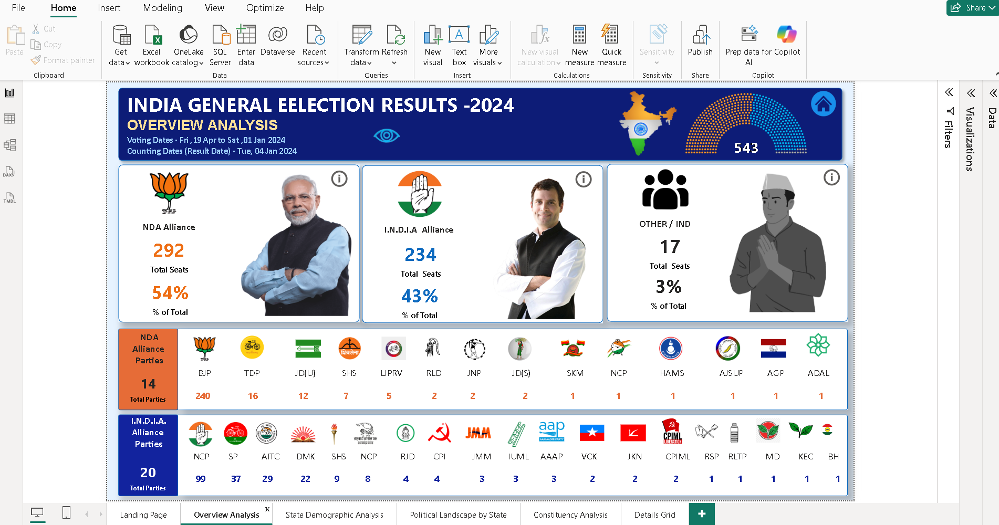

## India General Election Results 2024 – Power BI Dashboard

## 📌 Project Overview

This project presents an **interactive Power BI dashboard** for analyzing the **India General Election Results 2024**.
The dashboard provides a **comprehensive, multi-level analysis** of election outcomes with a focus on **seat distribution, alliance performance, state-wise trends, and constituency-level insights**.

The solution is designed to support **political analysts, researchers, policymakers, and data enthusiasts** in understanding electoral patterns and outcomes.

---

## 📊 Dashboard Preview

## 🎯 Objectives

* Analyze **seat distribution** among major political alliances and independent candidates
* Compare **NDA, I.N.D.I.A., and Other parties** at national and state levels
* Enable **state-wise and constituency-wise drill-down analysis**
* Present **candidate performance, vote share, and winning margins**
* Provide an intuitive and **user-friendly navigation experience**

---

## 📊 Dashboards & Analysis

### 1️⃣ Overview Analysis

* Total seats won by:

  * NDA Alliance
  * I.N.D.I.A. Alliance
  * Independent & Other Parties
* Percentage share of total seats by each group
* Bookmark-enabled navigation to detailed grids

---

### 2️⃣ State Demographic Analysis

* State-wise:

  * Total seats
  * NDA seats
  * I.N.D.I.A. seats
  * Majority alliance
* Interactive **map visualizations**
* Drill-through to detailed state-level data

---

### 3️⃣ Political Landscape by State

* Dynamic state selection
* Key metrics:

  * Seats won by NDA
  * Seats won by I.N.D.I.A.
  * Seats won by Independent & Others
* Visuals:

  * State map
  * Party-wise result grid
  * Donut chart for party seat share

---

### 4️⃣ Constituency Analysis

* In-depth constituency-level insights including:

  * Winning candidate
  * Runner-up and 2nd runner-up
  * Party affiliation
  * Total votes and vote share (%)
* Analysis of **voter turnout and competition intensity**

---

### 5️⃣ Details Grid

* Comprehensive tabular view with:

  * Constituency name
  * Winning and runner-up candidates
  * Party name and alliance
  * EVM votes, postal votes, total votes
  * Winning margin
* Features:

  * Drill-through support
  * Export-ready data
  * Bookmark-based “Show All Data” functionality

---

### 6️⃣ Landing Page

* Central navigation hub
* Clickable buttons/cards for:

  * Overview Analysis
  * State Demographics
  * Political Landscape by State
  * Constituency Analysis
* Clean, minimal, and user-friendly UI

---

## 🧮 Data Modeling & DAX

* Structured data model with proper relationships
* Custom **DAX logic** to classify political alliances:

  * NDA
  * I.N.D.I.A.
  * OTHER
* Optimized measures for accurate seat counts, percentages, and comparisons

---

## 🗂 Dataset Information

The project uses structured CSV datasets, including:

* Party-wise results
* State-wise results
* Constituency-wise results
* Alliance mapping data

All datasets are available in the `Datasets/` folder.

---

## 🛠 Tools & Technologies

* **Power BI Desktop**
* **DAX (Data Analysis Expressions)**
* **CSV datasets**
* **GitHub** (project versioning and documentation)

---

## 👤 Author

**Saurabh Chatur**
Power BI Developer | Data Analyst

---

## 📜 Disclaimer

This project is created for **educational and analytical purposes only**.
Election data is used to demonstrate data visualization, modeling, and analytical techniques.
